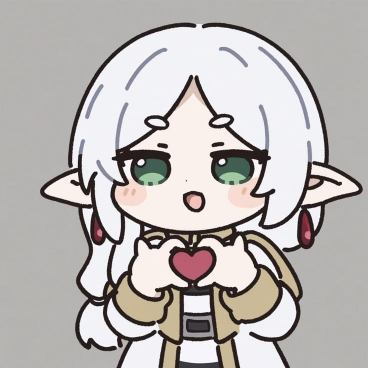
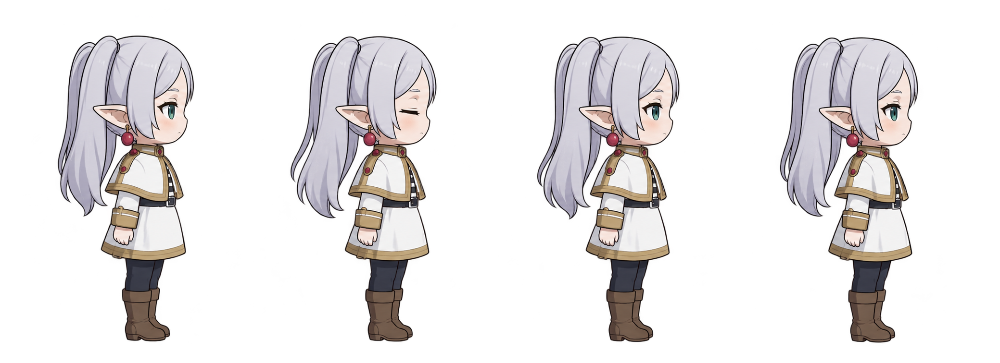
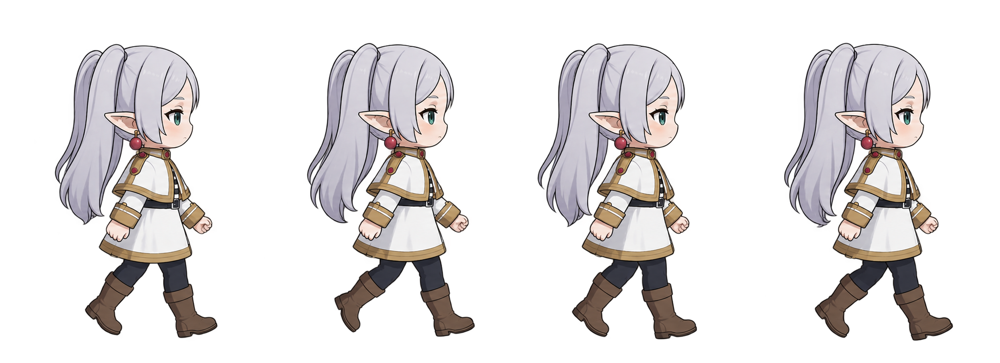
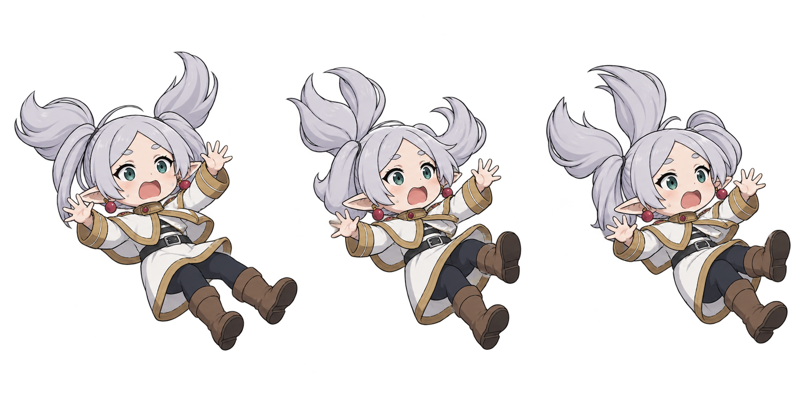
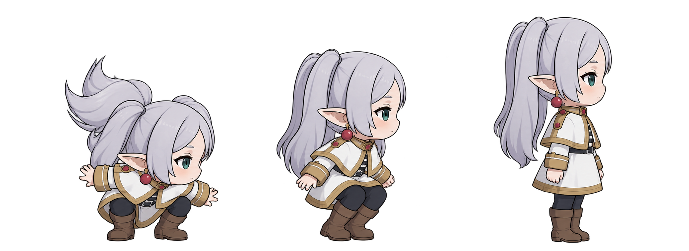

# Desktop Pet


A window-aware chibi mascot that lives on your desktop. Drag it, throw it, minimize it into a little bubble, and chat with it.



## Features

- **Walks on your desktop** — a pixel-art pet that walks across the virtual desktop, aware of monitor/taskbar bounds.
- **Drag & throw** — grab the pet and give it a flick; throw velocity is measured from your recent drag speed, and on landing it carries its momentum into a run.
- **Minimize to a bubble** — right-click and choose *— Minimize* to collapse the pet into a small circular bubble.
- **Close zone** — while dragging the bubble, a red ✕ circle appears at the bottom-center of the screen. Drop the bubble on it to close the app.
- **Chat window** — click the bubble to open a Messenger-style chat powered by an LLM (OpenAI-compatible Gemini endpoint).
- **Draggable & resizable chat** — drag by the header, resize from all four corners.
- **Respawn** — hit the respawn icon in the chat header and the pet falls back onto the screen from the top.
- **System tray** — show/hide the pet and quit from the tray menu.

## Sprite Sheets

The pet's animations are packed into pixel-art sprite sheets under `src/assets/`:

| Idle | Walk | Fall | Land |
| --- | --- | --- | --- |
|  |  |  |  |

## Tech Stack

| Layer | Tech |
| --- | --- |
| Desktop shell | [Tauri 2](https://tauri.app) (transparent, click-through window) |
| UI / animation | [PixiJS 8](https://pixijs.com), TypeScript, Vite |
| Backend | Rust — cursor polling for click-through, system tray, menu, LLM proxy |
| Chat LLM | OpenAI-compatible API -> Google Gemini |

## Getting Started

### Prerequisites

- Windows
- [Node.js](https://nodejs.org/) (18+)
- [Rust toolchain](https://rustup.rs/)

### Run in development

```bash
npm install
npm run tauri dev
```

### Build a release bundle

```bash
npm run tauri build
```

## Chat Configuration

The chat uses Google Gemini's OpenAI-compatible API. Provide your API key either via an environment variable or a local, git-ignored file:

- Environment variable: `PETFISH_API_KEY`
- Or file `src-tauri/.chat.env` (never committed), e.g. `PETFISH_API_KEY=your-key`

Optional overrides:

| Variable | Default |
| --- | --- |
| `PETFISH_API_KEY` | *(required)* |
| `PETFISH_API_BASE` | `https://generativelanguage.googleapis.com/v1beta/openai` |
| `PETFISH_MODEL` | `gemini-3.6-flash` |

## Project Structure

```
Playing_With_Tauri/
├─ src/                  # Frontend (TypeScript + PixiJS + CSS)
│  ├─ main.ts            # Pet lifecycle, bubble, chat window, close-zone
│  ├─ physics.ts         # Movement, gravity, throwing, landing
│  ├─ sprites.ts         # Sprite sheet packing + animation clips
│  ├─ chat.ts            # Chat history + reply trimming
│  └─ assets/            # Icons and sprite sheets
└─ src-tauri/            # Rust backend (Tauri)
   ├─ src/lib.rs         # Window/rect sync, tray, menus, Gemini proxy
   └─ .chat.env          # Your API key (git-ignored)
```

## License

Private project.